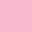

# Flexoki Color Palette

An inky color scheme for prose and code, designed for reading and writing on digital screens. Inspired by analog inks and warm shades of paper.

> [!NOTE]
> This documentation is based on the Flexoki color scheme by [Steph Ango](https://stephango.com/flexoki). This implementation includes research-based deviations from the original Flexoki specification to align with a majority of the current popular color schemes. For the complete original specification and additional resources, visit [stephango.com/flexoki](https://stephango.com/flexoki).

## Color Palette

The complete Flexoki color palette includes base colors and accent colors with exponentially increasing intensity as colors get lighter or darker, emulating pigment on paper.

### Base Colors

| Color                                                     | Name     | Hex       |
| :-------------------------------------------------------- | :------- | :-------- |
|     | paper    | `#FFFCF0` |
|   | base-50  | `#F2F0E5` |
|  | base-100 | `#E6E4D9` |
|  | base-150 | `#DAD8CE` |
|  | base-200 | `#CECDC3` |
|  | base-300 | `#B7B5AC` |
|  | base-400 | `#9F9D96` |
|  | base-500 | `#878580` |
|  | base-600 | `#6F6E69` |
|  | base-700 | `#575653` |
|  | base-800 | `#403E3C` |
|  | base-850 | `#343331` |
|  | base-900 | `#282726` |
|  | base-950 | `#1C1B1A` |
|     | black    | `#100F0F` |

### Red

| Color                                                    | Name    | Hex       |
| :------------------------------------------------------- | :------ | :-------- |
|   | red-50  | `#FFE1D5` |
|  | red-100 | `#FFCABB` |
|  | red-150 | `#FDB2A2` |
|  | red-200 | `#F89A8A` |
|  | red-300 | `#E8705F` |
|  | red-400 | `#D14D41` |
|  | red-500 | `#C03E35` |
|  | red-600 | `#AF3029` |
|  | red-700 | `#942822` |
|  | red-800 | `#6C201C` |
|  | red-850 | `#551B18` |
|  | red-900 | `#3E1715` |
|  | red-950 | `#261312` |

### Orange

| Color                                                       | Name       | Hex       |
| :---------------------------------------------------------- | :--------- | :-------- |
|   | orange-50  | `#FFE7CE` |
|  | orange-100 | `#FED3AF` |
|  | orange-150 | `#FCC192` |
|  | orange-200 | `#F9AE77` |
|  | orange-300 | `#EC8B49` |
|  | orange-400 | `#DA702C` |
|  | orange-500 | `#CB6120` |
|  | orange-600 | `#BC5215` |
|  | orange-700 | `#9D4310` |
|  | orange-800 | `#71320D` |
|  | orange-850 | `#59290D` |
|  | orange-900 | `#40200D` |
|  | orange-950 | `#27180E` |

### Yellow

| Color                                                       | Name       | Hex       |
| :---------------------------------------------------------- | :--------- | :-------- |
|   | yellow-50  | `#FAEEC6` |
|  | yellow-100 | `#F6E2A0` |
|  | yellow-150 | `#F1D67E` |
|  | yellow-200 | `#ECCB60` |
|  | yellow-300 | `#DFB431` |
|  | yellow-400 | `#D0A215` |
|  | yellow-500 | `#BE9207` |
|  | yellow-600 | `#AD8301` |
|  | yellow-700 | `#8E6B01` |
|  | yellow-800 | `#664D01` |
|  | yellow-850 | `#503D02` |
|  | yellow-900 | `#3A2D04` |
|  | yellow-950 | `#241E08` |

### Green

| Color                                                      | Name      | Hex       |
| :--------------------------------------------------------- | :-------- | :-------- |
|   | green-50  | `#EDEECF` |
|  | green-100 | `#DDE2B2` |
|  | green-150 | `#CDD597` |
|  | green-200 | `#BEC97E` |
|  | green-300 | `#A0AF54` |
|  | green-400 | `#879A39` |
|  | green-500 | `#768D21` |
|  | green-600 | `#66800B` |
|  | green-700 | `#536907` |
|  | green-800 | `#3D4C07` |
|  | green-850 | `#313D07` |
|  | green-900 | `#252D09` |
|  | green-950 | `#1A1E0C` |

### Cyan

| Color                                                     | Name     | Hex       |
| :-------------------------------------------------------- | :------- | :-------- |
|   | cyan-50  | `#DDF1E4` |
|  | cyan-100 | `#BFE8D9` |
|  | cyan-150 | `#A2DECE` |
|  | cyan-200 | `#87D3C3` |
|  | cyan-300 | `#5ABDAC` |
|  | cyan-400 | `#3AA99F` |
|  | cyan-500 | `#2F968D` |
|  | cyan-600 | `#24837B` |
|  | cyan-700 | `#1C6C66` |
|  | cyan-800 | `#164F4A` |
|  | cyan-850 | `#143F3C` |
|  | cyan-900 | `#122F2C` |
|  | cyan-950 | `#101F1D` |

### Blue

| Color                                                     | Name     | Hex       |
| :-------------------------------------------------------- | :------- | :-------- |
|   | blue-50  | `#E1ECEB` |
|  | blue-100 | `#C6DDE8` |
|  | blue-150 | `#ABCFE2` |
|  | blue-200 | `#92BFDB` |
|  | blue-300 | `#66A0C8` |
|  | blue-400 | `#4385BE` |
|  | blue-500 | `#3171B2` |
|  | blue-600 | `#205EA6` |
|  | blue-700 | `#1A4F8C` |
|  | blue-800 | `#163B66` |
|  | blue-850 | `#133051` |
|  | blue-900 | `#12253B` |
|  | blue-950 | `#101A24` |

### Purple

| Color                                                       | Name       | Hex       |
| :---------------------------------------------------------- | :--------- | :-------- |
|   | purple-50  | `#F0EAEC` |
|  | purple-100 | `#E2D9E9` |
|  | purple-150 | `#D3CAE6` |
|  | purple-200 | `#C4B9E0` |
|  | purple-300 | `#A699D0` |
|  | purple-400 | `#8B7EC8` |
|  | purple-500 | `#735EB5` |
|  | purple-600 | `#5E409D` |
|  | purple-700 | `#4F3685` |
|  | purple-800 | `#3C2A62` |
|  | purple-850 | `#31234E` |
|  | purple-900 | `#261C39` |
|  | purple-950 | `#1A1623` |

### Magenta

| Color                                                        | Name        | Hex       |
| :----------------------------------------------------------- | :---------- | :-------- |
|   | magenta-50  | `#FEE4E5` |
|  | magenta-100 | `#FCCFDA` |
|  | magenta-150 | `#F9B9CF` |
|  | magenta-200 | `#F4A4C2` |
|  | magenta-300 | `#E47DA8` |
|  | magenta-400 | `#CE5D97` |
|  | magenta-500 | `#B74583` |
|  | magenta-600 | `#A02F6F` |
|  | magenta-700 | `#87285E` |
|  | magenta-800 | `#641F46` |
|  | magenta-850 | `#4F1B39` |
|  | magenta-900 | `#39172B` |
|  | magenta-950 | `#24131D` |

## Theme System

### Theme Variables

Flexoki uses semantic color variables that automatically map to appropriate values based on theme selection:

#### Base Color Mappings

| Variable | Light Theme | Dark Theme | Usage                |
| :------- | :---------- | :--------- | :------------------- |
| `bg`     | paper       | black      | Main background      |
| `bg2`    | base-50     | base-950   | Secondary background |
| `ui`     | base-100    | base-900   | Borders              |
| `ui2`    | base-150    | base-850   | Hovered borders      |
| `ui3`    | base-200    | base-800   | Active borders       |
| `tx`     | base-850    | base-200   | Primary text         |
| `tx2`    | base-600    | base-500   | Muted text           |
| `tx3`    | base-500    | base-600   | Faint text           |

#### Accent Color Mappings

| Variable  | Light Theme | Dark Theme  | UI Usage             | Syntax Usage          |
| :-------- | :---------- | :---------- | :------------------- | :-------------------- |
| `red`     | red-600     | red-400     | Error text           | Errors                |
| `orange`  | orange-600  | orange-400  | Warning text         | Numbers               |
| `yellow`  | yellow-600  | yellow-400  | Attention text       | Constants             |
| `green`   | green-600   | green-400   | Success text         | Strings               |
| `cyan`    | cyan-600    | cyan-400    | Links, active states | Types                 |
| `blue`    | blue-600    | blue-400    | Information text     | Functions, attributes |
| `purple`  | purple-600  | purple-400  | Accent text          | Language features     |
| `magenta` | magenta-600 | magenta-400 | Highlight text       | Keywords              |

### Theme Selection

- **Light themes**: Use 600-level accent colors for syntax highlighting
- **Dark themes**: Use 400-level accent colors for syntax highlighting
- **Base colors**: Automatically mapped based on theme selection

## Syntax Highlighting

Research-based color assignments aligned with industry conventions and accessibility standards.

> [!IMPORTANT]
> Text colors are guidelines. Legibility always comes first. Adjust colors when they don't provide sufficient contrast in your specific environment.

| Element                | Color   | Usage                              |
| :--------------------- | :------ | :--------------------------------- |
| Comments               | tx3     | Faint text for code comments       |
| Keywords               | magenta | Language keywords (if, for, class) |
| Strings                | green   | String literals and text           |
| Functions              | blue    | Function names and calls           |
| Constants              | yellow  | Constants and literals             |
| Numbers                | orange  | Numeric values                     |
| Types                  | cyan    | Data types and type annotations    |
| Variables              | tx      | Variable names and identifiers     |
| Attributes             | tx      | Object properties and attributes   |
| Built-in functions     | purple  | Built-in functions and macros      |
| Punctuation, operators | tx      | Mathematical and logical operators |
| Errors                 | red     | Syntax errors and invalid code     |
| Imports                | cyan    | Import/include statements          |

### Color Rationale

Technical rationale for color assignments:

#### Industry-Standard Assignments

| Color Family | Programming Context        | Technical Rationale                                                            |
| :----------- | :------------------------- | :----------------------------------------------------------------------------- |
| **Magenta**  | Keywords & control flow    | Purple/magenta universally signals "special language constructs" (90%+ themes) |
| **Green**    | String literals            | Green represents literal text content within code structure                    |
| **Blue**     | Functions & methods        | Blue indicates callable/executable code blocks                                 |
| **Orange**   | Numbers & literals         | Orange draws attention to literal values without alarm (yellow = warning)      |
| **Cyan**     | Types & architecture       | Cyan indicates type definitions and structural elements                        |
| **Yellow**   | Constants                  | Yellow indicates immutable values and compile-time constants                   |
| **Purple**   | Language features & macros | Purple for meta-programming elements that transform or extend language         |
| **Red**      | Errors                     | Universal error indicator for syntax errors and problems                       |

#### Visual Hierarchy Principles

1. **Foreground Priority**: Variables and user content use default text color - they're the primary focus
2. **Accent Hierarchy**: Language constructs get distinctive colors, user content remains neutral
3. **Attention Balance**: Bright colors (orange, yellow) reserved for values requiring attention
4. **Cognitive Grouping**: Related concepts share colors (all functions blue, all types cyan)

#### Accessibility Considerations

- **Contrast Ratios**: All color combinations maintain WCAG AA compliance (4.5:1 minimum)
- **Color Blindness**: Multiple visual cues beyond color (brightness, context) aid comprehension
- **Perceptual Balance**: Colors chosen using Oklab color space for consistent perceived intensity

### Semantic Element Categories

Generic syntax highlighting recommendations applicable to any highlighting system:

#### Core Language Elements

| Element Category         | Color   | Rationale                                          |
| :----------------------- | :------ | :------------------------------------------------- |
| Comments & Documentation | tx3     | Subdued to not interfere with active code content  |
| Keywords                 | magenta | Magenta follows universal convention (90%+ themes) |
| Control Flow             | magenta | Consistent with keywords for cognitive grouping    |
| Function Keywords        | magenta | Language constructs treated uniformly              |

#### Literal Values & Constants

| Element Category   | Color  | Rationale                                        |
| :----------------- | :----- | :----------------------------------------------- |
| String Literals    | green  | Green aligns with "natural" content metaphor     |
| String Escapes     | purple | Purple for special/meta sequences within strings |
| Numbers            | orange | Orange for attention-drawing literal values      |
| Booleans           | orange | Consistent with other primitive literals         |
| Constants          | yellow | Yellow for permanent/immutable values            |
| Built-in Constants | orange | Orange distinguishes language-provided constants |

#### Functions & Identifiers

| Element Category     | Color | Rationale                                            |
| :------------------- | :---- | :--------------------------------------------------- |
| Function Definitions | blue  | Blue conveys stability and trustworthiness           |
| Function Calls       | blue  | Consistent with definitions for easy recognition     |
| Variables            | tx    | Default text for user-defined content                |
| Parameters           | tx2   | Slightly muted to distinguish from regular variables |
| Object Properties    | tx    | Default text for property access                     |

#### Types & Structure

| Element Category | Color | Rationale                                        |
| :--------------- | :---- | :----------------------------------------------- |
| Type Definitions | cyan  | Cyan for systematic, architectural elements      |
| Built-in Types   | cyan  | Consistent treatment of type system concepts     |
| Operators        | tx    | Default text for better visibility of operations |
| Punctuation      | tx2   | Subtle treatment of structural syntax elements   |

### Extended Semantic Elements

Advanced syntax highlighting for modern programming constructs:

#### Scoping & Organization

| Element Category | Color | Rationale                                      |
| :--------------- | :---- | :--------------------------------------------- |
| Namespaces       | cyan  | Cyan for organizational/architectural concepts |
| Modules          | cyan  | Consistent with namespace-level organization   |
| Packages         | cyan  | High-level structural elements                 |

#### Object-Oriented Constructs

| Element Category      | Color | Rationale                                       |
| :-------------------- | :---- | :---------------------------------------------- |
| Class Definitions     | cyan  | Cyan for type system and structural definitions |
| Interface Definitions | cyan  | Consistent with other type-defining constructs  |
| Enum Definitions      | cyan  | Part of type system architecture                |
| Methods               | blue  | Blue consistent with function treatment         |
| Properties            | tx    | Default text for property access patterns       |

#### Functional & Meta Elements

| Element Category    | Color  | Rationale                                          |
| :------------------ | :----- | :------------------------------------------------- |
| Local Variables     | tx     | Default text for scope-local user content          |
| Function Parameters | tx2    | Muted to distinguish parameter context             |
| Macros              | purple | Purple for meta-programming and special processing |
| Annotations         | tx2    | Muted for metadata that supplements main content   |
| Imports/Includes    | cyan   | Cyan for module organization and dependencies      |

## UI Elements

### UI Layer System

Flexoki organizes UI elements into distinct layers for consistent visual hierarchy:

| Layer      | Light Theme | Dark Theme | Z-Index | Usage                  |
| :--------- | :---------- | :--------- | :------ | :--------------------- |
| Background | paper       | black      | 0       | Main editor background |
| Secondary  | base-50     | base-950   | 1       | Sidebars, panels       |
| Surface 0  | base-100    | base-900   | 2       | Cards, dropdowns       |
| Surface 1  | base-150    | base-850   | 3       | Hover states           |
| Surface 2  | base-200    | base-800   | 4       | Active/selected        |
| Overlay 0  | base-300    | base-700   | 5       | Tooltips, popovers     |
| Overlay 1  | base-400    | base-600   | 6       | Modal backgrounds      |
| Overlay 2  | base-500    | base-500   | 7       | Shadows, borders       |

> [!NOTE]
> The Z-Index values are suggestions for visual hierarchy. Actual implementation may vary based on your editor or application's layout system.

### Editor Interface Elements

| Element              | Color  | Usage                              |
| :------------------- | :----- | :--------------------------------- |
| Line numbers         | tx3    | Subtle reference information       |
| Current line number  | tx2    | Slightly emphasized                |
| Cursor               | tx     | Primary text color for visibility  |
| Selection background | ui2    | Secondary UI color                 |
| Search matches       | yellow | Yellow for high visibility         |
| Current search       | orange | Orange for active search result    |
| Visual selection     | ui3    | Active border color                |
| Matching brackets    | tx2    | Muted to not distract from content |

### UI State Colors

Flexoki uses specific palette colors to provide subtle visual feedback for UI states:

> [!NOTE]
> These colors are selected from the Flexoki palette to provide subtle visual feedback without using opacity.

| Element        | Light Theme | Dark Theme | Usage                    |
| :------------- | :---------- | :--------- | :----------------------- |
| Selection BG   | blue-100    | blue-900   | Selected text background |
| Cursor Line BG | base-50     | base-950   | Current line highlight   |
| Search Match   | yellow-100  | yellow-900 | Find results             |
| Current Search | orange-100  | orange-900 | Active search result     |
| Hover Surface  | base-100    | base-900   | Interactive hover states |
| Disabled Text  | base-400    | base-600   | Disabled elements        |
| Drop Target    | cyan-50     | cyan-950   | Drag and drop zones      |
| Focus Ring     | blue-300    | blue-700   | Keyboard focus indicator |
| Indent Guide   | base-200    | base-800   | Indentation lines        |
| Whitespace     | base-300    | base-700   | Visible whitespace chars |

### Special UI States

Flexoki defines specific colors for interactive UI elements and their various states:

| Element                | State        | Light Theme | Dark Theme | Notes                  |
| :--------------------- | :----------- | :---------- | :--------- | :--------------------- |
| **Borders**            |
| Border                 | Active       | blue-400    | blue-600   | Current focus          |
| Border                 | Inactive     | base-200    | base-800   | Default state          |
| Border                 | Error        | red-400     | red-600    | Validation error       |
| Border                 | Success      | green-400   | green-600  | Valid state            |
| **Links**              |
| Link                   | Normal       | cyan-600    | cyan-400   | Unvisited              |
| Link                   | Visited      | purple-600  | purple-400 | Previously visited     |
| Link                   | Hover        | blue-600    | blue-400   | Mouse over             |
| Link                   | Active       | green-600   | green-400  | Being clicked          |
| **Badges & Pills**     |
| Badge BG               | Info         | blue-100    | blue-900   | Information            |
| Badge BG               | Success      | green-100   | green-900  | Completed              |
| Badge BG               | Warning      | yellow-100  | yellow-900 | Attention              |
| Badge BG               | Error        | red-100     | red-900    | Problem                |
| Badge FG               | All States   | tx          | tx         | Badge text             |
| **Buttons**            |
| Button                 | Primary BG   | blue-600    | blue-400   | Primary action         |
| Button                 | Secondary BG | base-200    | base-800   | Secondary action       |
| Button                 | Danger BG    | red-600     | red-400    | Destructive action     |
| Button                 | Hover        | +100 level  | -100 level | Hover state modifier   |
| **Marks & Highlights** |
| Mark 1                 | Background   | purple-100  | purple-900 | First highlight color  |
| Mark 2                 | Background   | cyan-100    | cyan-900   | Second highlight color |
| Mark 3                 | Background   | yellow-100  | yellow-900 | Third highlight color  |

## Specialized Colors

### Git and Diff Highlighting

Flexoki provides comprehensive colors for version control visualization:

| Element                 | Light Theme | Dark Theme | Usage                  |
| :---------------------- | :---------- | :--------- | :--------------------- |
| **Headers**             |
| Diff Header             | blue-600    | blue-400   | File comparison header |
| Hunk Header             | orange-600  | orange-400 | @@ line markers        |
| File Path               | purple-600  | purple-400 | a/file.txt b/file.txt  |
| Metadata                | base-400    | base-600   | Index, mode info       |
| **Line Backgrounds**    |
| Added Line BG           | green-50    | green-950  | New lines              |
| Removed Line BG         | red-50      | red-950    | Deleted lines          |
| Modified Line BG        | yellow-50   | yellow-950 | Changed lines          |
| **Word/Character Diff** |
| Added Word BG           | green-100   | green-900  | Inline additions       |
| Removed Word BG         | red-100     | red-900    | Inline deletions       |
| Modified Word BG        | yellow-100  | yellow-900 | Inline changes         |
| **Merge Conflicts**     |
| Current BG              | cyan-50     | cyan-950   | HEAD changes           |
| Incoming BG             | blue-50     | blue-950   | Branch changes         |
| Ancestor BG             | purple-50   | purple-950 | Base version           |
| **Gutter Icons**        |
| Added                   | green-600   | green-400  | + symbol               |
| Removed                 | red-600     | red-400    | - symbol               |
| Modified                | yellow-600  | yellow-400 | ~ symbol               |
| **Git Status**          |
| Untracked               | base-400    | base-600   | New untracked files    |
| Ignored                 | base-300    | base-700   | Ignored files          |
| Conflicted              | red-600     | red-400    | Merge conflicts        |
| Staged                  | green-600   | green-400  | Staged changes         |

### Diagnostic and Debug Colors

| Element             | Color  | Usage                             |
| :------------------ | :----- | :-------------------------------- |
| Error diagnostics   | red    | Red for errors                    |
| Warning diagnostics | orange | Orange for warnings               |
| Info diagnostics    | blue   | Blue for information              |
| Hint diagnostics    | tx2    | Muted for subtle suggestions      |
| Breakpoints         | red    | Red for debug breakpoints         |
| Debug highlights    | yellow | Yellow for execution highlighting |

### Terminal & ANSI Colors

Flexoki provides a complete 16-color ANSI palette that conforms to standard terminal color expectations while maintaining the Flexoki aesthetic:

> [!NOTE]
> This palette follows traditional ANSI color standards for maximum compatibility. Colors are optimized for both light and dark terminal themes.

#### Standard 16-Color Palette

| ANSI | Name           | Light Theme | Dark Theme  | Usage               |
| :--- | :------------- | :---------- | :---------- | :------------------ |
| 0    | Black          | black       | black       | Standard black      |
| 1    | Red            | red-600     | red-400     | Errors, alerts      |
| 2    | Green          | green-600   | green-400   | Success, additions  |
| 3    | Yellow         | yellow-600  | yellow-400  | Warnings            |
| 4    | Blue           | blue-600    | blue-400    | Information         |
| 5    | Magenta        | magenta-600 | magenta-400 | Special items       |
| 6    | Cyan           | cyan-600    | cyan-400    | Links, emphasis     |
| 7    | White          | base-50     | base-400    | Standard white/gray |
| 8    | Bright Black   | base-600    | base-500    | Dimmed/secondary    |
| 9    | Bright Red     | red-500     | red-300     | Bright errors       |
| 10   | Bright Green   | green-500   | green-300   | Bright success      |
| 11   | Bright Yellow  | yellow-500  | yellow-300  | Bright warnings     |
| 12   | Bright Blue    | blue-500    | blue-300    | Bright info         |
| 13   | Bright Magenta | magenta-500 | magenta-300 | Bright special      |
| 14   | Bright Cyan    | cyan-500    | cyan-300    | Bright emphasis     |
| 15   | Bright White   | paper       | paper       | Brightest white     |

#### Terminal Window Colors

| Element         | Light Theme | Dark Theme | Usage                    |
| :-------------- | :---------- | :--------- | :----------------------- |
| Cursor          | base-850    | base-200   | Terminal cursor          |
| Cursor Text     | paper       | black      | Text under cursor        |
| Selection       | blue-100    | blue-900   | Selected text background |
| Active Border   | blue-400    | blue-600   | Active window border     |
| Inactive Border | base-200    | base-800   | Inactive window border   |
| Bell Border     | yellow-400  | yellow-600 | Visual bell indicator    |

## Implementation Guidelines

### Design Principles

1. **Convention Alignment**: Color assignments follow established syntax highlighting conventions for intuitive code reading
2. **Perceptual Balance**: Colors maintain visual hierarchy without competing for attention
3. **Context Sensitivity**: Same colors serve different purposes in UI vs. syntax contexts
4. **Progressive Enhancement**: Basic Vim groups provide fallback, Tree-sitter adds precision, LSP adds context

> [!TIP]
> Use the semantic variables (tx, bg, ui) instead of direct color values for better theme consistency and easier maintenance.

### Implementation Approach

**Layer 1: Basic Syntax Groups** (Maximum Compatibility)

- Implement fundamental syntax categories first (comments, keywords, strings, etc.)
- Ensures compatibility with basic highlighting systems
- Provides fallback for simple or legacy highlighting engines

**Layer 2: Semantic Enhancement** (Precision)

- Add precise semantic category mappings for improved accuracy
- Focus on language-agnostic semantic consistency
- Use more granular color distinctions for syntax elements

**Layer 3: Contextual Highlighting** (Intelligence)

- Layer context-aware highlighting over semantic categories
- Provide advanced colors based on usage context (definitions vs references)
- Enable sophisticated features like scope-based dimming

### Color Usage Best Practices

1. **Foreground Colors**: Use semantic variables (`tx`, `red`, `green`, etc.) rather than direct palette colors
2. **Background Usage**: Apply base colors (`bg`, `bg2`, `ui`, etc.) with appropriate opacity for overlays
3. **Contrast Ratios**: Maintain WCAG AA compliance (4.5:1) for text on background
4. **Theme Consistency**: Ensure light/dark theme variants use appropriate color levels (600 vs 400)

### Testing Recommendations

1. **Cross-Language Testing**: Verify highlighting consistency across multiple programming languages
2. **Accessibility Testing**: Test with color blindness simulators and contrast checking tools
3. **Context Testing**: Ensure colors work well in different editor contexts (diff views, search results, etc.)
4. **Performance Testing**: Validate that complex highlight rules don't impact editor performance

## Attribution

Flexoki color scheme created by [Steph Ango](https://stephango.com/flexoki).
Licensed under the MIT License.

For the complete specification and additional ports, visit: <https://stephango.com/flexoki>
